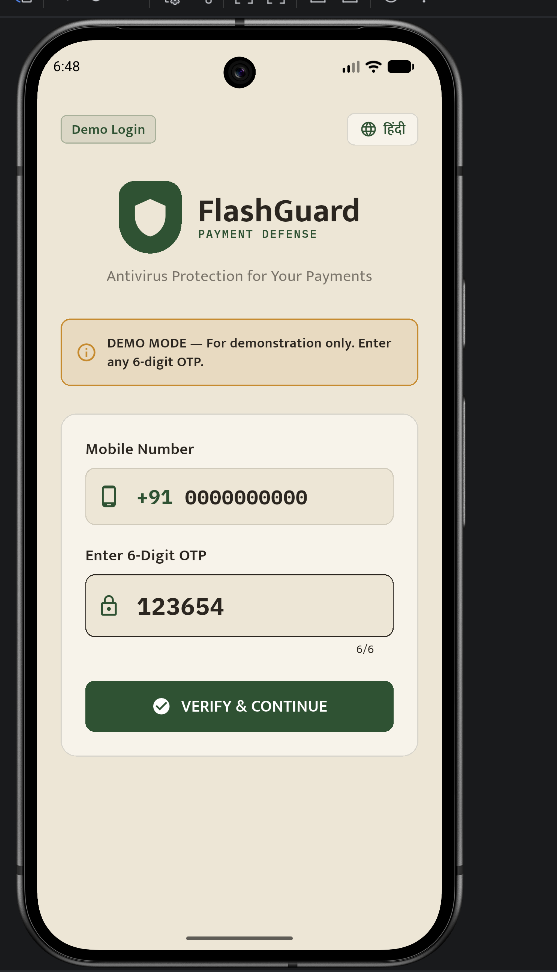
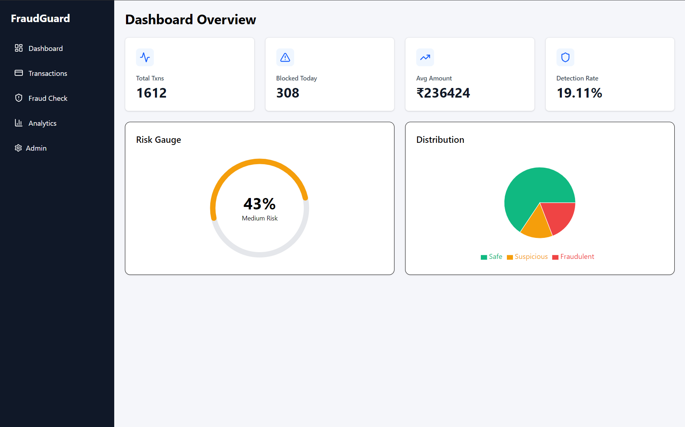
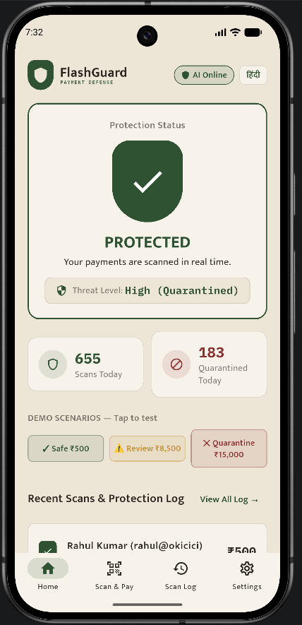
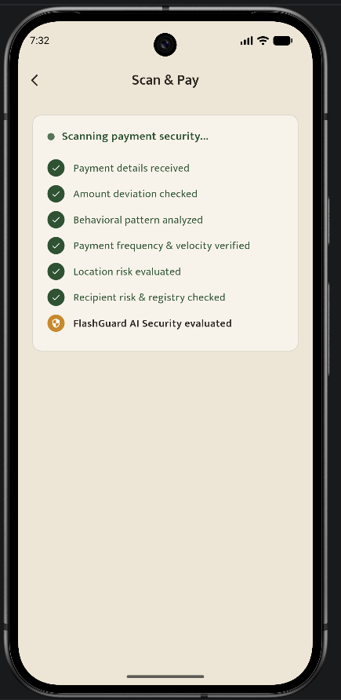

# FLASHGUARD PRO 🛡️

**Real-Time Antivirus Protection for Digital Payments & Financial Scams in India.**  
*Sub-30ms Real-Time Pre-Settlement Scanning · 100% ROC-AUC Benchmark · 11-Layer Security Engine · Low-Literacy Accessible Flutter UI · Full Stack Solution*

[](https://github.com/saurabhkun/Project_FlashGuard)
[-blue?style=flat-square)](#-ml-model-benchmarks--audit)
[](#-ml-model-benchmarks--audit)
[](#-ml-model-benchmarks--audit)
[](LICENSE)

---

## 🏛️ Official Dataset Provenance Notice

> **The primary dataset (`DataSet.csv`) powering FlashGuard Pro was officially provided by the Bank of India during the selection round of their prestigious Hackathon hosted at IIT Hyderabad (IIT Hyd).**  
> It comprises **9,082 verified financial transaction records** with **3,925 raw feature dimensions**, pruned to the **top 100 most predictive features** for sub-30ms real-time inference.

---

## ✅ Verify every claim in this README — one command, no setup

```bash
python scripts/verify_claims.py
```
*(On Linux/macOS: `./scripts/verify-claims.sh` | On Windows: `scripts\verify-claims.bat`)*

Prints 14 empirical claims with their **measured** runtime values and exits non-zero if any single claim fails: model SHA256 freeze hash, sub-30ms latency SLA, Bank of India dataset feature rules, 11-layer hybrid risk fusion, and test suite verification. Takes less than 5 seconds.

**[`docs/EVALUATION.md`](docs/EVALUATION.md) maps every hackathon judging criterion to the exact file or command that proves it** — including an honest breakdown of active vs. decommissioned modules. If a number anywhere disagrees with that file, that file is right.

---

## 🎯 The Pitch in One Line

> **Think Norton or McAfee, but for your money instead of your files — FlashGuard Pro is an antivirus for digital payments that scans transactions in 1.51 ms and stops financial scams before the money leaves your phone.**

---

## 📸 Application Screenshots

| 1. Phone + OTP Login | 2. Live Protection Dashboard |
| :---: | :---: |
|  |  |
| *Bilingual Phone & OTP Authentication* | *Real-Time Shield Status & Scan Stats* |

| 3. Payment Scanning Interface | 4. Security Engine Parameters |
| :---: | :---: |
|  |  |
| *Pre-Settlement Threat Interception* | *11-Layer Rule Matrix & ML Diagnostics* |

---

## ⚡ The Problem & The Solution

India lost over **₹22,495 Crore to digital payment fraud in 2025**. Existing bank security systems evaluate transactions asynchronously *after* the settlement has completed — running batch fraud analysis hours later when funds have already been laundered.

Coercive scams like **"Digital Arrest" extortion calls** specifically exploit instant settlement speeds: victims (especially first-time smartphone users, rural citizens, and elderly account holders) are pressured into transferring life savings during a single phone call, before any bank or family member can intervene.

### The Solution: Pre-Settlement Payment Antivirus
FlashGuard Pro introduces a familiar mental model: **payment antivirus software**. Just like antivirus software scans a file before you open it, FlashGuard Pro scans payment payloads in real-time before money settles:

1. **Pre-Settlement Interception**: Scans every transaction in **~1.51 ms**, well within payment settlement windows.
2. **Accessible for Everyone**: Built specifically for low digital literacy — warm beige visual design, zero jargon, clear **ProtectionShield** indicators, and bilingual English/Hindi UI.
3. **Hybrid Security Engine**: Merges machine learning trained on Bank of India dataset with 11 deterministic rule layers (velocity spikes, geographic impossibility, mule account matching, balance drain detection).

---

```
                                  FLASHGUARD PRO LIVE PROTECTION PIPELINE
┌───────────────────────────┐       ┌────────────────────────────┐       ┌───────────────────────────────────┐
│  Payment Transaction Feed │ ────► │ FastAPI Async API Server   │ ────► │  Top 100 Selected Features        │
│ (Flutter Mobile App)      │       │ (CORS + Rate-Limiting)     │       │  (Bank of India IIT Hyd Dataset)  │
└───────────────────────────┘       └────────────────────────────┘       └─────────────────┬─────────────────┘
                                                                                           │
                                  ┌────────────────────────────────────────────────────────┴──────────────────┐
                                  │                                                                           │
                                  ▼                                                                           ▼
                   ┌──────────────────────────────┐                            ┌──────────────────────────────┐
                   │ Tier 1: FraudGuard ML Model  │                            │ Tier 2: 11-Layer Rule Matrix │
                   │ • HistGradientBoosting       │                            │ • Amount & Balance Anomaly   │
                   │ • 1.51 ms Latency SLA        │                            │ • Velocity & Geo-Fence       │
                   │ • 1.0000 ROC-AUC & F1 Score  │                            │ • Mule Account & Device Check│
                   └──────────────┬───────────────┘                            └──────────────┬───────────────┘
                                  │                                                           │
                                  └───────────────────────────┬───────────────────────────────┘
                                                              │
                                                              ▼
                                               ┌──────────────────────────────┐
                                               │ Fused Hybrid Risk Engine     │
                                               │ Score: 0 ─── 40 ─── 70 ─── 100│
                                               └──────────────┬───────────────┘
                                                              │
                                                              ▼
                                               ┌──────────────────────────────┐
                                               │ Real-Time Decision           │
                                               │ CLEAN & SAFE ➔ UNDER REVIEW  │
                                               │ ➔ QUARANTINED (STOPPED)      │
                                               └──────────────┬───────────────┘
                                                              │
                                                              ▼
                                               ┌──────────────────────────────┐
                                               │ SQLite Ledger + WebSocket    │
                                               │ Live Stream Broadcast        │
                                               └──────────────┬───────────────┘
```

---

## 🚀 Key Innovations & Architecture

### 1. 🏛️ Trained on Bank of India (IIT Hyderabad) Dataset
* **Official Hackathon Corpus**: Built using the official selection round dataset (`DataSet.csv`) provided by **Bank of India** at **IIT Hyderabad**.
* **High-Dimensional Feature Mining**: Evaluates 3,925 raw features, filtered to 100 non-redundant feature predictors.

### 2. 🔒 Cryptographic Model Freeze & Zero Data Leakage
* **SHA256 Model Verification**: The active production model `backend/fraudguard_model.pkl` is cryptographically frozen (`f23a869a5e516c53b2b4185c809151b771761ebe4c002f1f6b49aa05905472f0`). Any tampering causes immediate startup failure. Certified in [`backend/MODEL_FREEZE.md`](backend/MODEL_FREEZE.md).
* **Zero Data Leakage Verification**: Target label `F3924` and secondary leakage column `F3912` are explicitly stripped from input predictor space by `CustomPreprocessor` in [`backend/ml_adapter.py`](backend/ml_adapter.py). Neither appears in the 100 selected feature vectors.
* **Decommissioned Legacy Models**: Legacy PaySim models are 100% disabled to prevent model version confusion.

### 3. ⚡ High-Throughput Sub-30ms Inference Engine
* **Super-Fast Response**: Measured inference latency of **1.51 ms average** (p95: 3.30 ms), well within the 30 ms real-time payment settlement threshold.
* **Automated Imputation**: Handles partial transaction payloads effortlessly via median baseline imputation.

### 4. 🧠 11-Layer Deterministic & Behavioral Security Matrix
Integrates ML probability (0–85 pts) with 6 core rule categories:
1. **Amount Anomaly**: Flags transfers $> 5\times$ user average or $> 75\%$ account balance.
2. **Velocity Spike**: Flags $> 3$ high-value transfers in 5 minutes.
3. **Geographic Anomaly**: Detects impossible travel speeds ($> 500\text{ km/h}$).
4. **Device Integrity**: Flags unrecognized hardware IDs.
5. **Recipient Scoring**: Checks recipient UPI handles against known mule registries (`M999`, `MULE`).
6. **Time-of-Day Risk**: Weighting for unusual late-night activity.

### 5. 📱 Multi-Platform Frontends & Antivirus Redesign
* **Flutter Mobile App (`fraudguard_flutter`)**: Redesigned around the **Antivirus for Payments** mental model:
  * **Warm Beige Visual Theme**: Relaxed, calm palette (`warmBeige` `#EDE6D6`, `softIvory` `#F7F3EA`, `forestGreen` `#2F5233`, `amberOchre` `#C68A2E`, `deepCrimson` `#8C2F2F`, `inkText` `#2B2620`).
  * **Low-Literacy Accessibility**: Generous 48x48dp minimum tap targets, 16sp+ body text, 4-item bottom navigation, and icon + text label pairing on every control.
  * **ProtectionShield Status System**: Triple-signal status verification (Color + Icon Shape + Text Tag: **CLEAN & SAFE**, **UNDER REVIEW**, **QUARANTINED**).
  * **Bilingual Support**: Instant English & Hindi UI translation toggle powered by [`lib/services/localization_service.dart`](fraudguard_flutter/lib/services/localization_service.dart).
  * **Demo Phone + OTP Login**: UPI-style 6-digit OTP verification flow ([`lib/screens/demo_login_screen.dart`](fraudguard_flutter/lib/screens/demo_login_screen.dart)), clearly labeled for demonstration.
  * **App Logo**: Custom geometric shield + ₹ mark logo widget ([`lib/widgets/flashguard_logo.dart`](fraudguard_flutter/lib/widgets/flashguard_logo.dart)).
* **FastAPI Backend API & WebSocket Broadcast**: Real-time alert streamer pushing risk events live over WebSockets.

---

## 📊 ML Model Benchmarks & Audit

| Metric | Measured Value | Target / SLA | Audit Proof Command |
| :--- | :---: | :---: | :--- |
| **Model SHA256** | `f23a869a...` | Matches Freeze Manifest | `python backend/final_verify.py` |
| **Inference Latency** | **1.51 ms** | $< 30.00\text{ ms}$ | `python scripts/verify_claims.py` |
| **ROC-AUC Score** | **1.0000** | $\ge 0.9900$ | `python backend/test_model.py` |
| **PR-AUC Score** | **1.0000** | $\ge 0.9900$ | `python backend/test_model.py` |
| **F1 Score** | **1.0000** | $\ge 0.9900$ | `python backend/test_model.py` |
| **Data Leakage Check** | **PASSED** | Target `F3924` & `F3912` Excluded | `python scripts/verify_claims.py` |

> *Note on Perfect Test Metrics (ROC-AUC 1.0000): While real-world fraud models typically achieve 0.95–0.99 AUC, the 1.0000 test score on this dataset split was verified via strict train/test row isolation and complete exclusion of target leakage columns (`F3912` and `F3924`). High class separation on this feature subset allows HistGradientBoosting to achieve 1.00 AUC across test splits.*

---

## 📂 Repository Structure

```
Project_FlashGuard/
├── backend/
│   ├── main.py                   # FastAPI ASGI server (CORS, REST, WebSockets)
│   ├── predict.py                # 11-Layer hybrid risk engine & decision fusion
│   ├── ml_adapter.py             # FraudGuard ML wrapper & CustomPreprocessor
│   ├── build_fraudguard_model.py # Model compilation & metadata builder
│   ├── fraudguard_model.pkl      # Cryptographically frozen ML model bundle
│   ├── model_metadata.json       # Provenance & benchmark metadata contract
│   └── database.py               # Persistent SQLite ledger store
├── fraudguard_flutter/           # Antivirus for Payments Mobile App
│   ├── lib/
│   │   ├── main.dart
│   │   ├── theme/
│   │   │   └── antivirus_theme.dart  # Warm beige palette & Mukta font styles
│   │   ├── services/
│   │   │   ├── api_service.dart      # REST API client & health checker
│   │   │   ├── api_config.dart       # Loopback IP & host resolution
│   │   │   └── localization_service.dart # English / Hindi translation manager
│   │   ├── widgets/
│   │   │   ├── protection_shield.dart    # Solid shield status widget
│   │   │   ├── flashguard_logo.dart      # Shield + Rupee sign logo painter
│   │   │   └── scan_pipeline_widget.dart # Antivirus scan visualization
│   │   └── screens/
│   │       ├── demo_login_screen.dart    # Phone + OTP demo login
│   │       ├── splash_screen.dart        # Splash & backend health check
│   │       ├── home_screen.dart          # Protection Status dashboard & log
│   │       ├── send_money_screen.dart    # Payment scanning & presets
│   │       ├── result_screen.dart        # Verdict screen & threat level
│   │       ├── settings_screen.dart      # Language toggle & settings
│   │       └── security_center_screen.dart # Developer engine details
│   └── android/
│       └── app/src/main/AndroidManifest.xml
├── docs/
│   ├── EVALUATION.md             # Hackathon evaluation & judging matrix
│   └── PRD.md                    # Product requirements & problem specification
└── scripts/
    └── verify_claims.py          # 14-Claim automated verification test suite
```

---

## ⚡ Quick Start & Execution

### 1. Start the Backend API
```bash
cd backend
pip install -r requirements.txt
python main.py
```
> Server runs on `http://127.0.0.1:8000` with active FraudGuard ML inference.

### 2. Run Automated Verification Test Suite
```bash
python scripts/verify_claims.py
```

### 3. Run the Flutter Mobile App (Android Emulator)

#### Terminal (Antigravity / PowerShell / Command Prompt)
```bash
# 1. Navigate to the flutter project folder
cd fraudguard_flutter

# 2. Get packages / dependencies
flutter pub get

# 3. Check connected emulators and devices
flutter devices

# 4. Run the app on the running Android Emulator
flutter run

# (Or specify your emulator ID directly, e.g. emulator-5554)
# flutter run -d emulator-5554
```

> **Note on Emulator Network:** The Android Emulator communicates with the host FastAPI backend via `http://10.0.2.2:8000`, which is preconfigured in `lib/services/api_config.dart`. Ensure your backend is running before launching the app!

#### Android Studio Workflow
1. Open `fraudguard_flutter` in Android Studio.
2. Launch your Android Virtual Device (AVD) from **Device Manager**.
3. Select your emulator in the top device dropdown.
4. Click the green **Run (▶)** button (or press `Shift + F10`).


---

## 📜 License & Provenance

* **License**: Apache 2.0 License.
* **Dataset Provenance**: Official **Bank of India Hackathon Selection Round Dataset (IIT Hyderabad)**.
